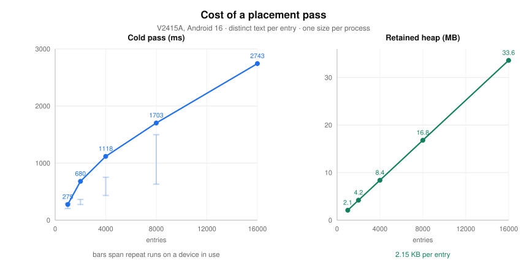
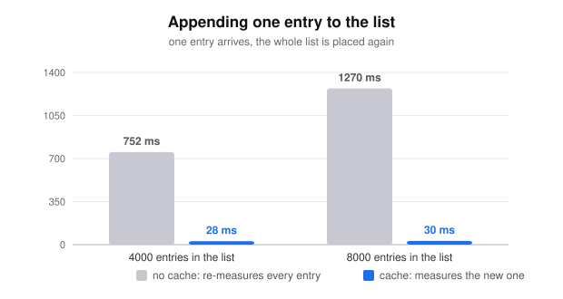

# Performance

Cost of a placement pass, measured on a V2415A running Android 16.

[English](PERFORMANCE.md) · [简体中文](PERFORMANCE.zh-CN.md)

> **Generated by an AI assistant.** The figures are measurements taken on the device named above, not estimates. The commands under Reproducing regenerate them.

## What is measured

`DanmakuOverlay` measures its entries and assigns them lanes in a single pass, and reruns that pass whenever the entry list, the style or the layer width changes. `PlacementCostTest` drives `placeDanmaku` directly, with distinct text per entry so that no entry can be answered from a text cache. That is the expensive case, and the case a real danmaku list presents.

Each size runs in its own process, after a warmup the timing excludes. Entry text is `弹幕内容第<index>条` plus up to seven further characters, measured with `DanmakuStyle()` defaults at density 3.5, in a layer 1260 px wide with a 56 px gap.



| Entries | Cold pass | Per entry | Retained heap | Per entry |
| --- | --- | --- | --- | --- |
| 1,000 | 275 ms | 0.275 ms | 2.1 MB | 2.1 KB |
| 2,000 | 680 ms | 0.340 ms | 4.2 MB | 2.1 KB |
| 4,000 | 1,118 ms | 0.280 ms | 8.4 MB | 2.1 KB |
| 8,000 | 1,703 ms | 0.213 ms | 16.8 MB | 2.1 KB |
| 16,000 | 2,743 ms | 0.171 ms | 33.6 MB | 2.2 KB |

"Retained heap" is the memory the placed list continues to hold once every unreachable object has been collected: one measured layout plus one placement record per entry. Each entry adds 2.15 KB irrespective of list size. 16,000 entries hold 33.6 MB against a 256 MB limit, so the heap ceiling is not the constraint. Differences between rows in the table are rounding.

The per-entry cost falls as the list grows, because a longer pass amortises JIT warmup over more entries. The large-list figures describe steady state; the small-list figures include cold-compiler overhead.

The constraint is therefore main-thread time rather than memory. A pass over 16,000 entries blocks for approximately 2.7 seconds, and the cost is dominated by `TextMeasurer.measure`, which performs a real text layout. Lane allocation scans the lanes once per entry and the list is sorted once, neither of which approaches the cost of measurement.

## Appending one entry

Entries arrive one at a time, so the pass the overlay reruns most often is the one in which the list grew by a single entry. A cache that does not outlive a pass makes that rerun re-measure every preceding entry, which is quadratic over a session.

`MeasurementCache` is keyed on text and font size, survives between passes, and drops the keys the current list no longer refers to. It is discarded whenever the style, the measurer or the density changes.



| Entries | Cold pass | Growing by one entry |
| --- | --- | --- |
| 4,000 | 752 ms | 28 ms |
| 8,000 | 1,270 ms | 30 ms |

The remaining 28 to 30 ms is the portion of a pass that is not measurement: sorting the list, allocating lanes and building the placement records. That portion still scales with the whole list, which a sliding window over the entries would address.

One layout is shared by every entry of the same text and size. That sharing is what makes the cache effective, and it is also the reason the renderer passes `DanmakuItem.color` to `drawText` explicitly: a single layout can carry only one colour.

## Caveats

- Timings vary by a factor of two to three between runs on a device in active use. The bars on the first chart span the repeat runs behind each point. Retained heap does not vary.
- Measured against a debug build, which is slower than a release build.
- One size per process, as described under reproducing.
- The figures come from a single device and describe the shape of the cost, not a guaranteed value.

## Reproducing

```bash
./gradlew :danmaku:installDebug :danmaku:installDebugAndroidTest
adb shell am instrument -w -e class xyz.larkzhh.danmaku.PlacementCostTest#entries8000 \
  xyz.larkzhh.danmaku.test/androidx.test.runner.AndroidJUnitRunner
```

One size per invocation, rather than the whole class in one run. A run covering every size lasts long enough for a device that freezes background processes to terminate the test process part-way, and that failure is reported as an empty `<failure>` with no out-of-memory line. Each size reports its figures as soon as it has them, so the sizes that already completed remain in logcat under the `PlacementCost` tag.
